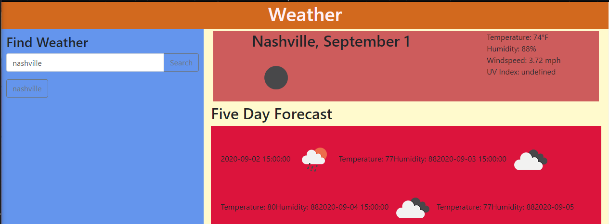

# Weather Dashboard

## Description

This is a website to quickly search for weather information. Simply type a city name into the search bar  
and it will return the current weather in the top section including:
* City Name
* Weather Icon
* Date
* Temperature in degrees fahrenheit
* Humidity
* Windspeed
* UV Index

In the bottom section it will show a five day forecast for the city you searched featuring:
* Date
* Weather Icon
* Temperature in Degrees Fahrenheit
* Humidity

Your searches will be saved as buttons under the search bar to quickly search for those cities weather again in the future.  
They are saved using local storage.

## Usage
Type the name of the city you would like to find the weather for in the search bar and hit search.

## Deployed Link
https://millerrich.github.io/weather-dashboard/

